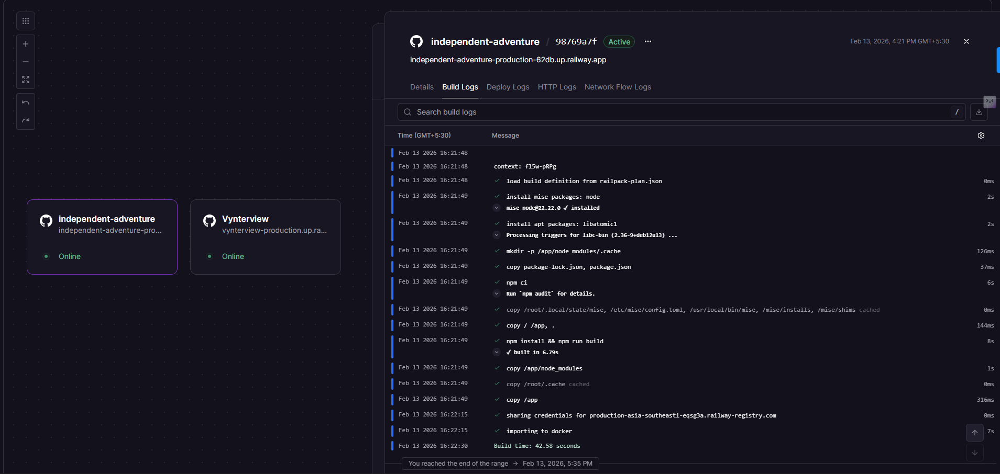
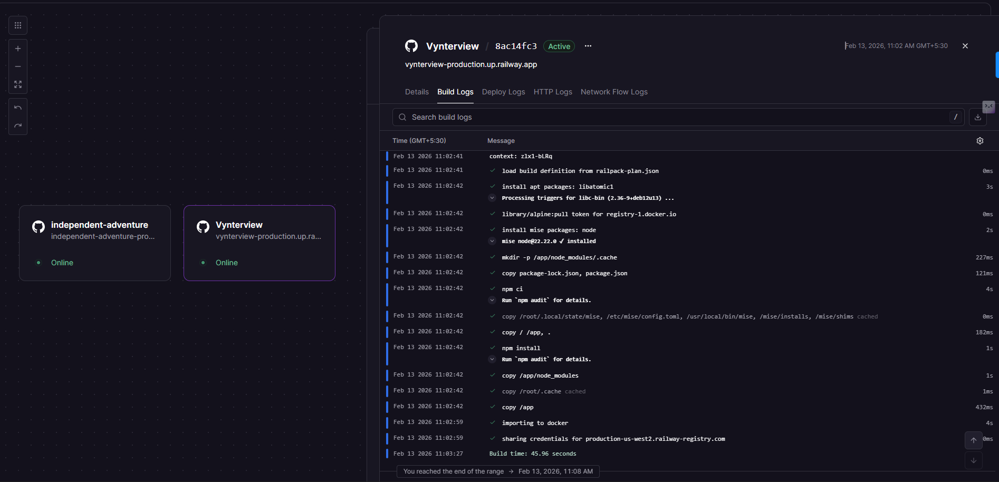
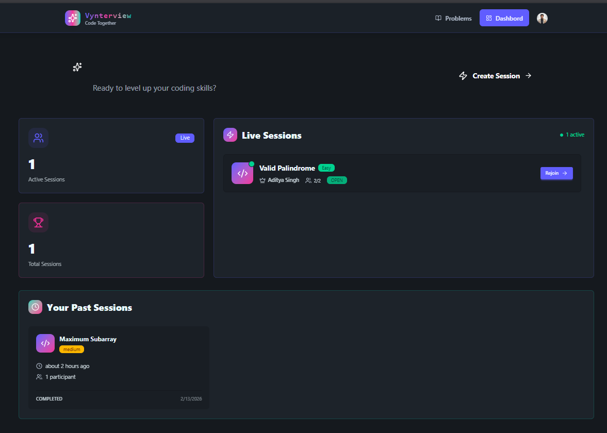
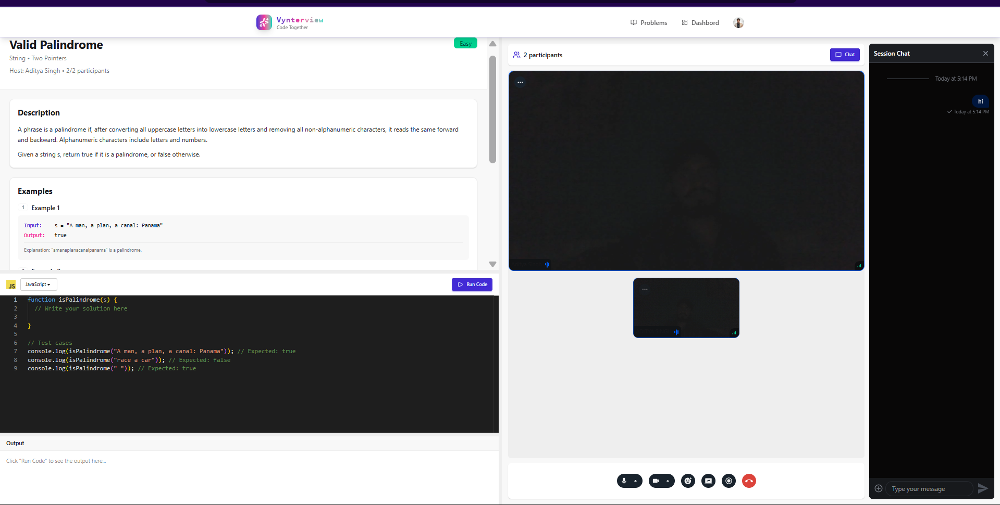

# ⚡ Vynterview: Real-Time Collaborative Interview Platform

             

> **The seamless bridge between talent and opportunity.** Vynterview is a high-fidelity technical interview platform that combines live video conferencing, synchronized code editing, and multi-language runtime execution in a single, secure environment.

🔗 **Live Demo:** [https://independent-adventure-production-62db.up.railway.app/](https://independent-adventure-production-62db.up.railway.app/)

---

## 📸 Screenshots

| **Interactive Dashboard** | **Live Coding Arena** |
|:---:|:---:|
|  |  |
| *Real-time stats & session management* | *Monaco Editor + Video Call + Output Console* |

---

## 🚀 Key Features

### 🛠️ Engineering & Architecture
* **Event-Driven Architecture:** Utilizes **Inngest** to handle complex background workflows (user sync, session cleanup), ensuring 100% database consistency between Clerk (Auth) and MongoDB.
* **Secure Webhook Synchronization:** Implemented robust webhook handlers to listen for identity events, eliminating data drift.
* **Sandboxed Code Execution:** Integrated **Piston API** to safely compile and run user code (C++, Java, Python, JS) in isolated containers, preventing RCE vulnerabilities.
* **JWT & Axios Interceptors:** Custom Axios interceptors automatically inject rotation-proof authentication tokens into every API request, ensuring seamless security.

### 💻 The Interview Experience
* **VS Code-Like Environment:** Powered by **Monaco Editor**, offering syntax highlighting, linting, and a familiar developer experience.
* **Zero-Latency Collaboration:** Real-time state synchronization allows interviewers and candidates to type and debug simultaneously.
* **Integrated Video/Audio:** Built on **Stream IO (WebRTC)** for high-quality, low-latency communication without needing third-party tools like Zoom.
* **Multi-Language Support:** First-class support for **JavaScript, C++, Java, and Python**.

### 🛡️ Security & Access
* **Identity Management:** Powered by **Clerk** for secure, session-based authentication.
* **Room Locking:** Privacy controls to strictly limit rooms to two participants (Interviewer & Candidate).

---

## 🏗️ Tech Stack

| Domain | Technologies |
| :--- | :--- |
| **Frontend** | React.js (Vite), Tailwind CSS, Monaco Editor, Lucide React |
| **Backend** | Node.js, Express.js, Mongoose (ODM) |
| **Database** | MongoDB Atlas (NoSQL) |
| **Auth & Queues** | Clerk (Auth), Inngest (Event Queues) |
| **Real-Time** | Stream SDK (Video/Audio), WebSockets |
| **DevOps** | Railway (CI/CD Deployment), Git/GitHub |

---

## ⚙️ System Architecture

1.  **Client Layer:** React application with TanStack Query for efficient state management and caching.
2.  **API Gateway:** Express.js REST API protected by Clerk Middleware.
3.  **Execution Engine:** Code is sent to a stateless Piston container; results (stdout/stderr) are streamed back to the client.
4.  **Event Bus:** Inngest functions listen for `user.created` or `session.ended` events to trigger DB updates asynchronously.

---

## 🔧 Getting Started Locally

Follow these steps to run Vynterview on your local machine.

### Prerequisites
* Node.js (v18+)
* MongoDB URI
* Clerk, Stream, & Inngest API Keys

### Installation

1.  **Clone the repository**
    ```bash
    git clone [https://github.com/adityasunnysingh1/Vynterview.git](https://github.com/adityasunnysingh1/Vynterview.git)
    cd Vynterview
    ```

2.  **Install Dependencies**
    Install dependencies for the root, frontend, and backend.
    ```bash
    npm install
    cd Frontend && npm install
    cd ../Backend && npm install
    ```

3.  **Environment Configuration 🔐**

    You need to create **two** `.env` files. One in the `Frontend` folder and one in the `Backend` folder.

    **A. Frontend Configuration**
    Navigate to `Frontend/` and create a `.env` file:
    ```env
    VITE_API_URL=http://localhost:5000/api
    VITE_CLERK_PUBLISHABLE_KEY=pk_test_... (Your Clerk Publishable Key)
    VITE_STREAM_API_KEY=... (Your Stream API Key)
    ```

    **B. Backend Configuration**
    Navigate to `Backend/` and create a `.env` file:
    ```env
    PORT=5000
    NODE_ENV=development
    MONGO_URL=mongodb+srv://... (Your MongoDB Connection String)

    # Auth (Clerk)
    CLERK_PUBLISHABLE_KEY=pk_test_...
    CLERK_SECRET_KEY=sk_test_...

    # Background Jobs (Inngest)
    INNGEST_EVENT_KEY=... (From Inngest Dashboard)
    INNGEST_SIGNING_KEY=...

    # Real-Time (GetStream)
    STREAM_API_KEY=...
    STREAM_API_SECRET=...

    # Client Redirects
    CLIENT_URL=http://localhost:5173
    ```

4.  **Run the App 🚀**
    Open two separate terminals to run the servers concurrently:

    **Terminal 1 (Backend):**
    ```bash
    cd Backend
    npm run dev
    ```

    **Terminal 2 (Frontend):**
    ```bash
    cd Frontend
    npm run dev
    ```

    Visit `http://localhost:5173` to view the app!

---

## 🤝 Contributing

Contributions are welcome! This project follows the "feature-branch" workflow.
1.  Fork the Project
2.  Create your Feature Branch (`git checkout -b feature/AmazingFeature`)
3.  Commit your Changes (`git commit -m 'Add some AmazingFeature'`)
4.  Push to the Branch (`git push origin feature/AmazingFeature`)
5.  Open a Pull Request

---

## 📬 Contact

**Aditya Singh** - Full Stack Developer
* [GitHub](https://github.com/adityasunnysingh1)
* [LinkedIn](https://linkedin.com/in/adityasunnysingh)
* [Email](mailto:mnnitadityasingh@gmail.com)

---

<div align="center">
  <sub>Built with ❤️ by Aditya Singh using the MERN Stack.</sub>
</div>
